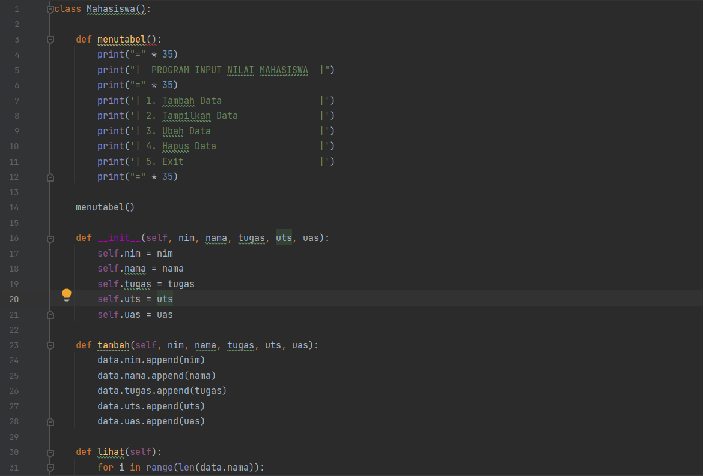

# labpy07
# PRAKTIKUM 8 LATIHAN OOP
<P> NAMA	: KHOLID WAHYUDI
<p> KELAS	: TI.22.B2
<p> MATA KULIAH	: BAHASA PEMROGRAMAN(PYTHON)

# Source Code

Program ini adalah program sederhana daftar nilai mahasiswa yang dibuat dengan mengaplikasikan penggunaan class.


# Penjelasan 

1. Membuat class </b>
	* Langkah pertama adalah membuat/mendeklarasikan sebuah class Mahasiswa(): yang didalamnya terdapat atribut NIM, Nama, nilai tugas, nilai UTS dan nilai UAS. Untuk mendeklarasikan sebuah class didalam OOP kita harus gunakan def__init__ dan juga self.
```Python
def __init__(self, nim, nama, tugas, uts, uas):
        self.nim = nim
        self.nama = nama
        self.tugas = tugas
        self.uts = uts
        self.uas = uas
```
2. Membuat Menu Tabel
    * Untuk membuat table sebuah menu kita dapat menggunakan fungsi menutabel(): yang didalamnya terdapat program sebuah menu yang dapat di input.
```Python
def menutabel():
        print("=" * 35)
        print("|  PROGRAM INPUT NILAI MAHASISWA  |")
        print("=" * 35)
        print('| 1. Tambah Data                  |')
        print('| 2. Tampilkan Data               |')
        print('| 3. Ubah Data                    |')
        print('| 4. Hapus Data                   |')
        print('| 5. Exit                         |')
        print("=" * 35)
```
3. Menambahkan Data
    * Disini kita perlu menambahkan method seperti menambahkan, menampilkan, menghapus, dan mengubah data mahasiswa. Pada sebuah method tambah() ini berfungsi untuk menambahkan data. Dalam method ini kita menggunakan append() agar data yang terakhir ditambahkan ada di urutan list paling akhir.
```Python
def tambah(self, nim, nama, tugas, uts, uas):
        data.nim.append(nim)
        data.nama.append(nama)
        data.tugas.append(tugas)
        data.uts.append(uts)
        data.uas.append(uas)
```
4. Membuat Method Tambah
    * Disini kita perlu menambahkan method seperti menambahkan, menampilkan, menghapus, dan mengubah data mahasiswa. Pada sebuah method tambah() ini berfungsi untuk menambahkan data. Dalam method ini kita menggunakan append() supaya data yang terakhir ditambahkan, ada di urutan list paling akhir
```Python
 def tambah(self, nim, nama, tugas, uts, uas):
        data.nim.append(nim)
        data.nama.append(nama)
        data.tugas.append(tugas)
        data.uts.append(uts)
        data.uas.append(uas)
```
5. Membuat Method Lihat
    * Method lihat() Berguna untuk menampilkan seluruh data yang telah ditambahkan. Bilamana data tersebut belum diinput/data tersebut sudah terhapus, Maka akan keluar ouput dengan tulisan "TIDAK ADA DATA". Kita menggunakan for loop untuk menampilkan banyaknya data. Nantinya data akan ditampilkan sebanyak n kali.
```Python
def lihat(self):
        for i in range(len(data.nama)):
            print("|", i + 1, "  |", end="")
            print('{0:<25}'.format(self.nama[i]), end="")
            print("|", self.nim[i], end="")
            print(" |", self.tugas[i], end="")
            print("    |", self.uts[i], end="")
            print("  |", self.uas[i], " | ", end="")
            print(f'{((self.tugas[i] * 30 / 100) + (self.uts[i] * 35 / 100) + (self.uas[i] * 35 / 100)) :.2f}', " |")
```
6. Membuat Method Ubah
    * Method ubah() ini berfungsi sebagai menu mengubah data yang telah diinput, Inputan tersebut didalamnya terdapat atribut nama, Sedangkan untuk penginputan sebuah nim, tugas, uts, dan uas dapat kita ubah sesuai kebutuhan.
```Python
def ubah(self, nim, nama, tugas, uts, uas):
        self.nim[no] = nim
        self.nama[no] = nama
        self.tugas[no] = tugas
        self.uts[no] = uts
        self.uas[no] = uas
```
7. Membuat Method Hapus
    * Source Code dibawah adalah untuk penghapusan sebuah data pada program yang sebelumnya telah diinput. Dan inputan dari kodingan ini berdasarkan "nama" yang sebelumnya telah diinput.
```Python
 def hapus(self):
        del self.nim[no]
        del self.nama[no]
        del self.tugas[no]
        del self.uts[no]
        del self.uas[no]
```
8. Membuat Dictionary
    *Mendeklarasikan satu dictionary kosong sebagai tempat menyimpan data-data yang sudah kita input. Disini ada 5 list kosong yang nanti isinya terdapat NIM, Nama, nilai tugas, nilai UTS dan nilai UAS.
```Python
data = Mahasiswa([], [], [], [], [])
```
9. Menjalankan program
    *Untuk menjalankan program sama seperti tugas sebelumnya,kita bisa input melalui masing-masing methods, seperti pada sebuah while loop yang didalamnya Terdapat conditional seperti source code dibawah ini.
```Python
while True:
    menu = input("(1)Tambah data, (2)Tampilkan data, (3)Ubah data, (4)Hapus data, (5)Keluar: ")

    if menu == "1":
        print("\nTAMBAH DATA")
        data.tambah(
            input("Masukkan NIM \t : "),
            input("Masukkan Nama\t : "),
            int(input("Nilai Tugas\t\t : ")),
            int(input("Nilai UTS\t\t : ")),
            int(input("Nilai UAS\t\t : "))
        )
        print("\nData berhasil ditambahkan")

    elif menu == "2":
        print()
        print("=" * 74)
        print("|                        DAFTAR NILAI MAHASISWA                          |")
        print("=" * 74)
        print("| No  |          Nama           |    NIM    | TUGAS | UTS | UAS |  AKHIR |")
        print("=" * 74)
        if len(data.nama) != 0:
            data.lihat()
        else:
            print("|                             TIDAK ADA DATA                             |")
        print("=" * 74)

    elif menu == "3":
        print("\nUBAH DATA")
        print("Masukkan Nama Yang Telah Diinput")
        ubah = input("Masukkan Nama : ")
        if ubah in data.nama:
            no = data.nama.index(ubah)
            print()
            print("Masukkan Data Baru")
            data.ubah(
                input("Masukkan NIM \t : "),
                input("Masukkan Nama\t : "),
                int(input("Nilai Tugas\t\t : ")),
                int(input("Nilai UTS\t\t : ")),
                int(input("Nilai UAS\t\t : "))
            )
        else:
            print(ubah, "DATA TIDAK DITEMUKAN")

    elif menu == "4":
        print("\nHAPUS DATA")
        print("Masukkan Nama Yang Telah Diinput")
        hapus = input("Masukkan Nama : ")
        if hapus in data.nama:
            no = data.nama.index(hapus)
            data.hapus()
            print("Data", hapus, "Berhasil dihapus")
        else:
            print(hapus, "DATA TIDAK DITEMUKAN")
```
10. Menghentikan Program
    * Jika data sudah selesai diinput, Pilih menu ke (Keluar) yaitu "5", Maka program secara otomatis akan berhenti.
```Python
    elif menu == "5":
        print("\nTHANK YOU :)\n")
        break
    else:
        print("\nPerintah yang dimasukkan salah!\n")
```

